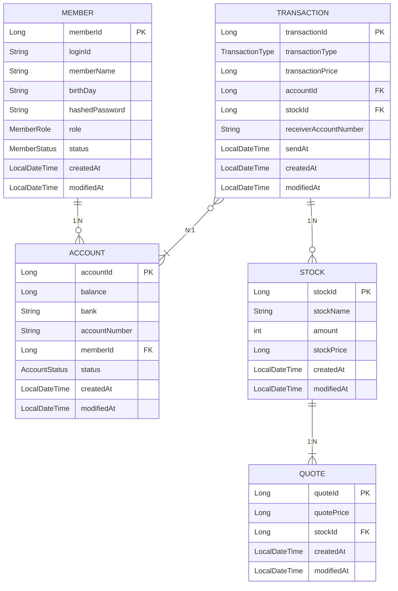

# toss-sever-batch
Numble Toss Server Batch

## ERD(Entity Relationship Diagram)
* MEMBER: 회원
* ACCOUNT: 계좌
* TRANSACTION: 거래 내용, 거래 방식 (송금, 결제, 입금, 예약 결제 등)
* STOCK: 주식
* QUOTE: 주식 시세

```mermaid
erDiagram
    MEMBER ||--o{ ACCOUNT : "1:N"
    MEMBER {
        Long memberId PK
        String loginId
        String memberName
        String birthDay
        String hashedPassword
        MemberRole role
        MemberStatus status
        LocalDateTime createdAt
        LocalDateTime modifiedAt
    }
    ACCOUNT {
        Long accountId PK
        Long balance
        String bank
        String accountNumber
        Long memberId FK
        AccountStatus status
        LocalDateTime createdAt
        LocalDateTime modifiedAt
    }
    
    TRANSACTION ||--o{ STOCK : "1:N"
    TRANSACTION }o--|{ ACCOUNT: "N:1"
    TRANSACTION {
        Long transactionId PK
        TransactionType transactionType
        Long transactionPrice
        Long accountId FK
        Long stockId FK
        String receiverAccountNumber
        LocalDateTime sendAt
        LocalDateTime createdAt
        LocalDateTime modifiedAt
        
    }
    STOCK ||--|{ QUOTE : "1:N"
    STOCK {
        Long stockId PK
        String stockName
        int amount
        Long stockPrice
        LocalDateTime createdAt
        LocalDateTime modifiedAt
    }
    QUOTE {
        Long quoteId PK
        Long quotePrice
        Long stockId FK
        LocalDateTime createdAt
        LocalDateTime modifiedAt
    }

```
